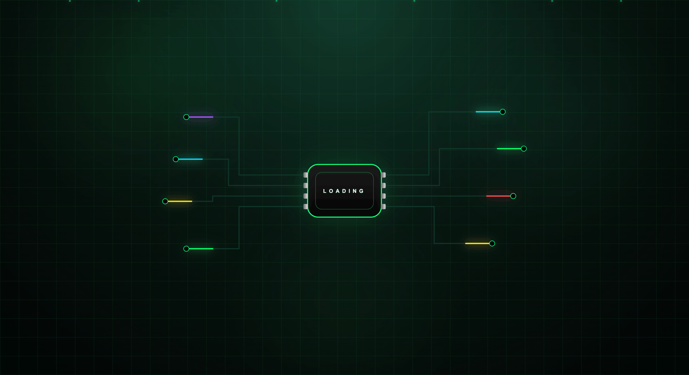

# Futuristic Circuit Board Loader

A futuristic motherboard-inspired loading animation built using pure SVG and CSS.

The design features animated PCB traces, glowing neon signals, cyberpunk aesthetics, energy nodes, and a central processing chip to create a modern tech-inspired loading experience.

## Features

* Pure SVG + CSS
* Futuristic motherboard design
* Animated neon signal flow
* Glowing PCB traces
* Cyberpunk visual effects
* Responsive SVG layout
* Lightweight and dependency-free
* Perfect for portfolios and landing pages

## Preview

Features a central processor chip connected to multiple animated PCB traces with colorful flowing signals.



## Technologies Used

* HTML5
* CSS3
* SVG

## Use Cases

* Loading Screens
* Landing Pages
* Portfolio Websites
* Tech Product Showcases
* Developer Projects
* Dashboard Interfaces

## Installation

Clone the repository:

```bash
git clone https://github.com/DesignCodeWithAV/futuristic-circuit-board-loader.git
```

Open `index.html` in your browser.

## Customization

You can easily modify:

* Signal colors
* Animation speed
* Chip styling
* Background effects
* PCB trace paths
* Glow intensity

## License

Free to use for personal and educational projects.

## Author

Design & Code With AV
@DesignCodeWithAV

Built with HTML, CSS, and SVG.
